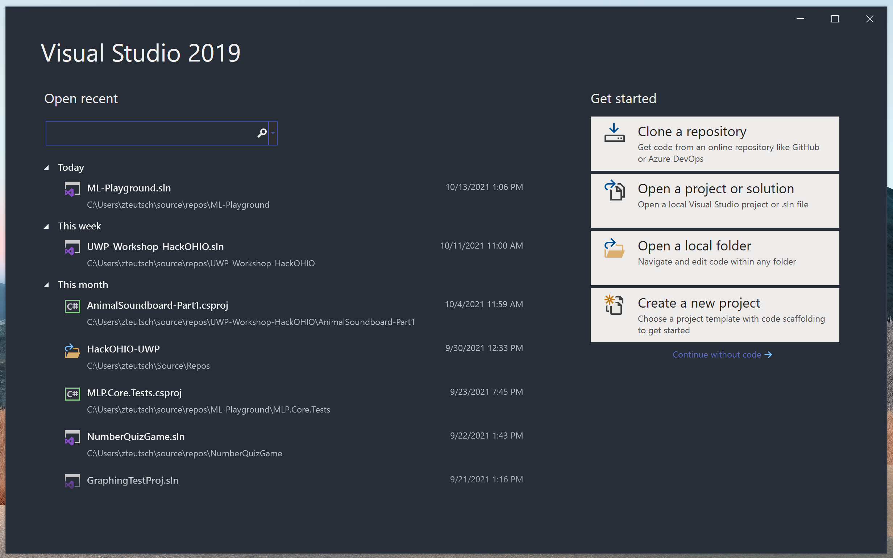
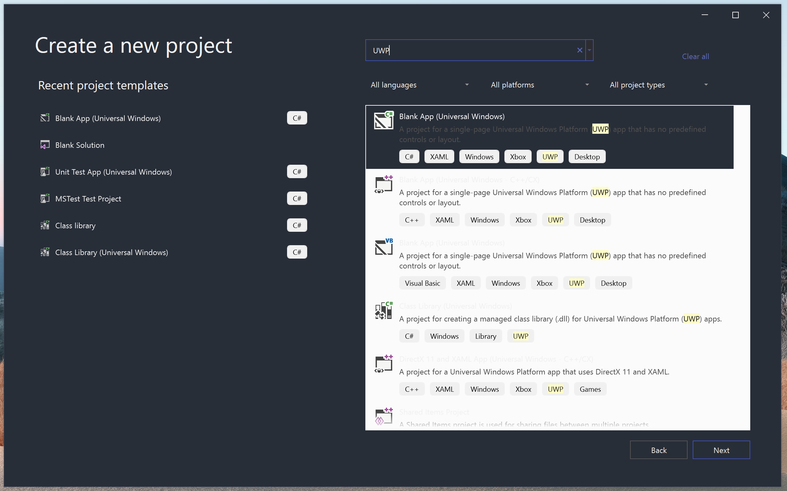
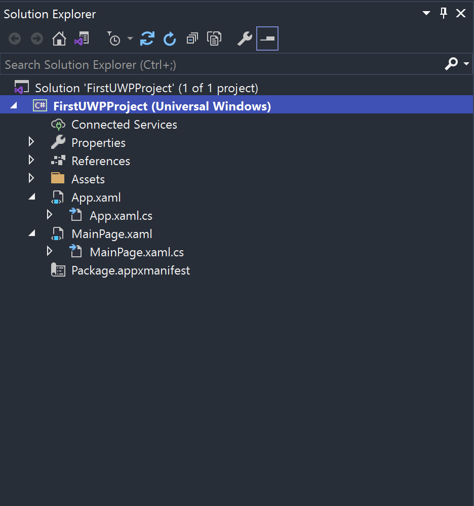
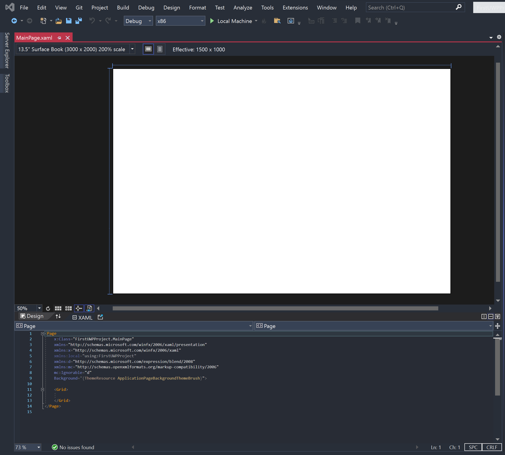
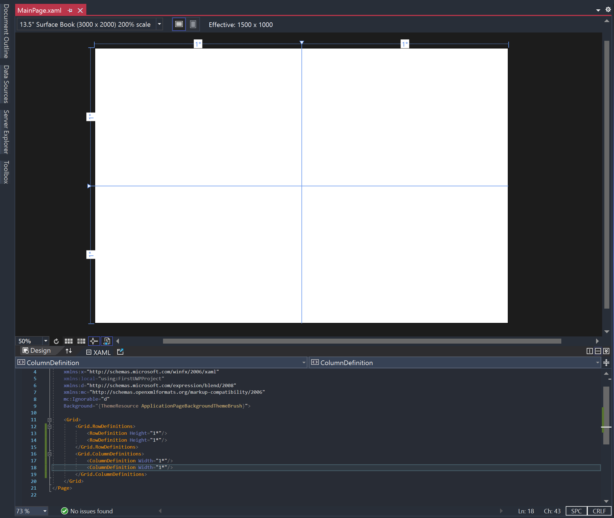
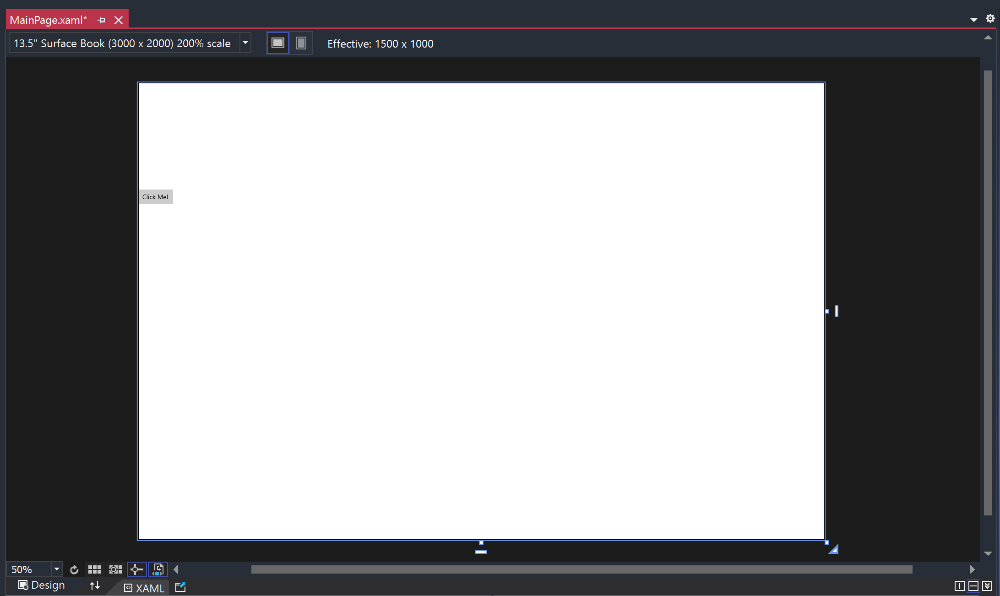
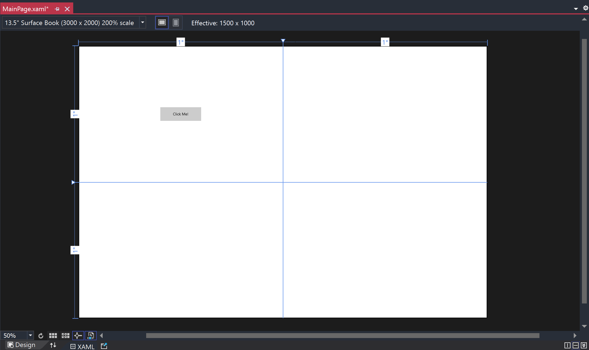
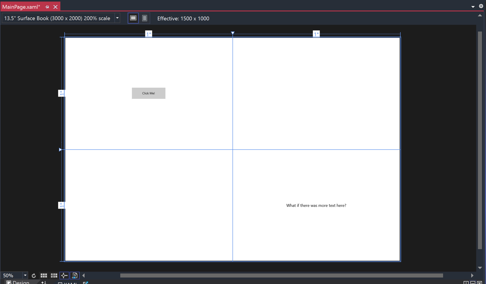
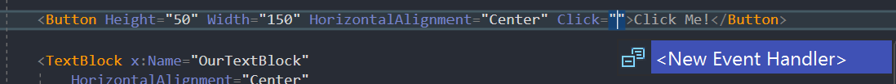
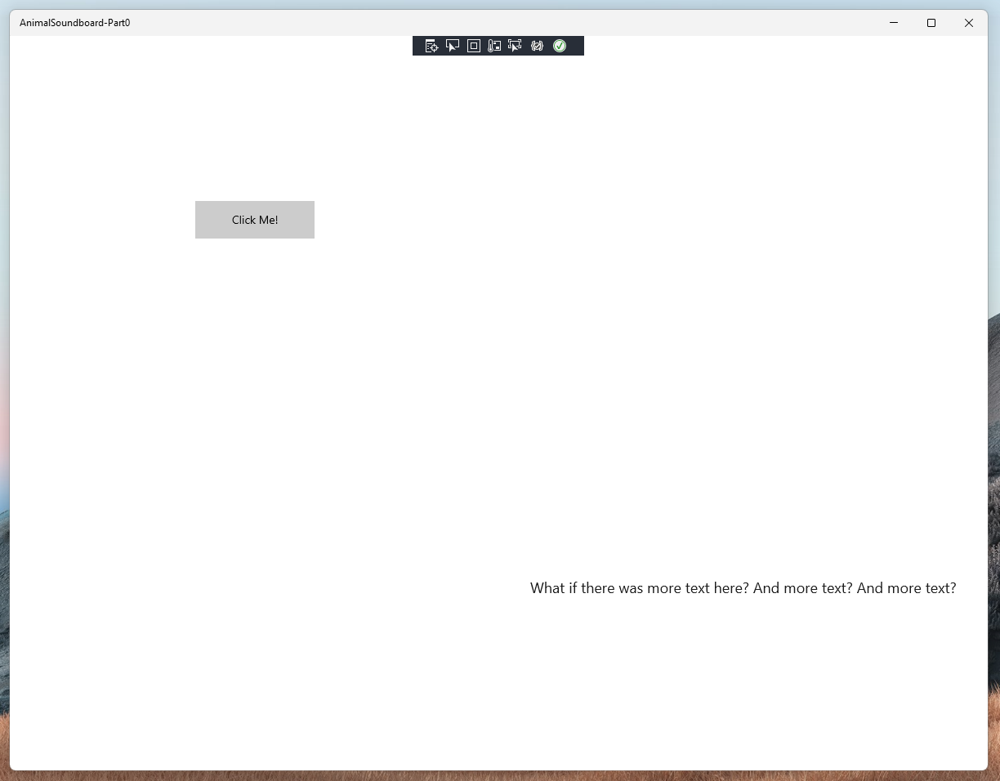

# UWP Beginner's Guide
## Getting Started
Before we get started, let's make sure your development environment is properly set up.  
You can find all the instructions for setting up Visual Studio and download Visual Studio at these links below:  

**[Installing Tools For Windows App Development](https://docs.microsoft.com/en-us/windows/apps/windows-app-sdk/set-up-your-development-environment?tabs=stable)**  
**[Visual Studio 2019 Download](https://docs.microsoft.com/en-us/visualstudio/releases/2019/release-notes)**

The default installer settings for Visual Studio 2019 should have all the workloads you need for UWP development by default, but reference the above guide just to confirm you're getting all the dependencies you need. Pay attention to Step 5 of the set up, which will have you enable developer mode. If you skip this step, Visual Studio may prompt you to enable it when you create your first project.

### Github Source
I would also recommend cloning or browsing the github repository for this tutorial as well. It contains all the code used in this walkthrough and has been thoroughly commented out for reference:  

**[Github: Soundboard Demo Code](https://github.com/zateutsch/UWP-Workshop-HackOHIO)**

## Creating A Blank UWP Project
Let's get right into it!

When you launch Visual Studio you should see this screen:  



Click on "Create a new project", the last option on the right side.

The next page will allow you to select from existing development templates. Search for UWP and select "Blank App (Universal Windows)" and click Next.



The following page will prompt you to name your project, go ahead and choose whatever name you see fit. You can also edit the save location on this page as well, but I just use the default repos directory.

Click "Okay" for the default target versions, and your new project should open up!  

## So what am I looking at here?
On the right side of Visual Studio you should have a "Solution Explorer" that looks like this:



Here you can navigate the files in your project. We won't be touching most of the files in this template for our purposes, but here's a quick breakdown just in case you were curious:

Files we **won't** be working with:

- **App.xaml**: In this file, you can declare resources that will be used application-wide, instead of specific to a single page in your application.
- **App.xaml.cs**: This is the entrypoint for your application. This file handles the start up/launch logic of your application. For more complicated applications, this file is key for making sure all your application-wide resources, services, and dependencies are loaded in properly when your app is launched.
- **Package.appxmanifest**: This file is where you manage a lot of the meta-properties of your application: things like visual resources, display names, and package versioning. Visual Studio has a handy built-in editor for working with this file if you ever need to make changes.

Files we **will** be editing:
- **MainPage.xaml**: This file is the XAML code that represents the UI layer of our MainPage. In this file, we can define the visual look and feel of our page by adding various UI elements and styling them however we want.
- **MainPage.xaml.cs**: This file is the C# code-behind portion of our MainPage. In this file, you can place the logic that allows the user to interact with the UI.

Every page in your application will have both a XAML UI file (.xaml) and a C# code file (.xaml.cs). I find it helpful to remember that these two pieces are really just two parts to the same whole. When you add an element to your XAML file, you're instantiating a new object in your MainPage class. And if you write a function in your C# file, that code will be referenceable in your XAML file.  

If you wanted to, you could write your whole application in C# and ditch the XAML all together!

## Getting Some UI On Our Page
Let's open up our **MainPage.xaml** and add some UI.

When you double-click that file, it should open up a XAML editor tool that allows you to view both the visual design of your file and the XAML code below:

 

### Working With a Grid

If you look at the XAML, you'll see an empty **Grid** control ("control" is default the UWP terminology for a UI element).
Grids are a handy tool for positioning other controls throughout our page. For our purposes, we are going to keep all of our UI within that Grid control.

As you can see, the Grid starts out empty, so lets add some row and column definitions to it:
```xml
<Grid>
    <Grid.RowDefinitions>
        <RowDefinition Height="1*"/>
        <RowDefinition Height="1*"/>
    </Grid.RowDefinitions>
    <Grid.ColumnDefinitions>
        <ColumnDefinition Width="1*"/>
        <ColumnDefinition Width="1*"/>
    </Grid.ColumnDefinitions>
</Grid>
```
Lets break down what we did here:
- We added `<Grid.RowDefinitions>` and `<Grid.ColumnDefinitions>` to our Grid control.
- To each of these sections we added two `<RowDefinition>` and two `<ColumnDefinition>`.
- Every definition has a height/width property with a value of "1\*". This "\*" syntax is all about proportional sizing. If a row has a height of 1\*, it will take up **one** share of all the available space. If you have two rows, both with 1*, they will each have 1/2 of the available space. The same goes for columns and their width.

If this is a little confusing, it can help to look at the design view of our application, which will show us our grid lines:


We have two columns of equal width, because each of our definitions is taking up 1 share of the width, and we have two rows of equal height, because each of our defintions is taking up 1 share of the height.

If you're following along, I would reccomend playing with this numbers to see how changing them affects how space is divided between rows and columns.

### Adding a Button

Now we have our Grid, let's add something to it.
Just below our Grid's row and columns definitions, let's add a button.

```xml
<Grid>
    <Grid.RowDefinitions>
        <RowDefinition Height="1*"/>
        <RowDefinition Height="1*"/>
    </Grid.RowDefinitions>
    <Grid.ColumnDefinitions>
        <ColumnDefinition Width="1*"/>
        <ColumnDefinition Width="1*"/>
    </Grid.ColumnDefinitions>

    <Button>Click me!</Button>
</Grid>
```

Your UI should look this:  



The button will default to the top left section of your Grid (Row 0, Column 0). We'll cover how to move a control to a different grid area in just a second.

That button is a little small and hugging the left boundary, let's update some of its properties to fix that:

```xml
<Button Height="50" Width="150" HorizontalAlignment="Center">Click Me!</Button>
```

Our new button:



Sweet! Right now, if you click the button, nothing happens, but we'll fix that soon.

### Now, let's add a TextBlock

Just below your button, add this code:
```xml
<TextBlock x:Name="OurTextBlock" 
    HorizontalAlignment="Center" 
    VerticalAlignment="Center" 
    Grid.Row="1" 
    Grid.Column="1"
    FontSize="18">
    What if there was more text here?</TextBlock>
```

Which gives us:



There's some new properties here, most importantly:
- `Grid.Row` which lets us set the grid row for our textblock
- `Grid.Column` which lets us set the grid column for text block
- `x:Name` this is a special property that doesn't affect the appearance, but will allow us to reference this control in the C# file, which will become important in just a second.

### Adding Some Functionality to Our Button

Let's go back to our button and add the "Click" property. After typing "Click", you should see an autocomplete pop up that looks like this:



Hit enter to allow the editor to create a New Event Handler for us.

The new button control code should look like this:
```xml
<Button Height="50" Width="150" HorizontalAlignment="Center" Click="Button_Click">Click Me!</Button>
```

If we switch over to our **MainPage.xaml.cs** file, we'll see that a `Button_Click` function has been created for us that looks like this:
```csharp
private void Button_Click(object sender, RoutedEventArgs e)
{

}
```
Whenever our button is clicked, the code inside that function will be run.

Let's change our TextBlock with our button (remember we named our TextBlock "OurTextBlock"):
```csharp
private void Button_Click(object sender, RoutedEventArgs e)
{
    this.OurTextBlock.Text += " And more text?";
}
```
Now when we click our button, we'll get:



And that's it! Your first little bit of UI interaction on UWP!

If you want to take it further, here are some more beginner friendly resources to check out:

- [Official UWP Getting Started Documentation](https://docs.microsoft.com/en-us/windows/uwp/get-started/)
- [Windows Development for Absolute Beginners](https://channel9.msdn.com/Series/Windows-10-development-for-absolute-beginners)
