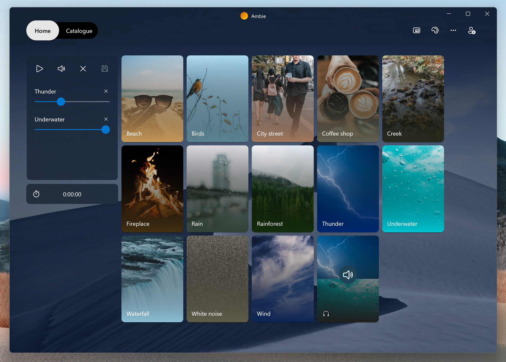
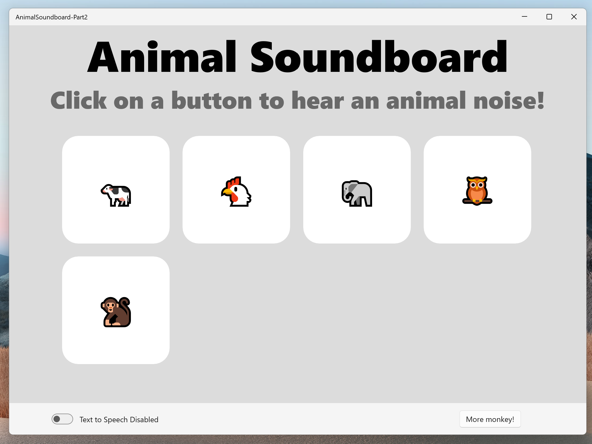

# Building Your First UWP Application

## What's the deal with UWP?  

Universal Windows Platform is all about developing apps that are not only for Windows, but look, feel, and interact like they *should* be on Windows. Any device that runs Windows can run a UWP application, and UWP allows for integration and styling that really makes your application feel like it belongs on Windows.

One of my favorite UWP applications is [Ambie](https://github.com/jenius-apps/ambie), an open source, white-noise sound application built by one of my colleagues, [Daniel Paulino](https://twitter.com/kid_jenius):  




Ambie is an awesome app, so let's try to imitate it!

## UWP Animal Soundboard

What if instead of soothing atmospheric noises and a level of iterative polish, Ambie had obnoxious animal noises and was built in 30 minutes?



As simple as this demo app is, it shows some cool things you can do right away with UWP:
- Working with different types of media (in our case, audio, but its just as easy to get started with video, photo, etc.)
- Speech Synthesis! Just one example of a neat API included with UWP
- Simple, easy-to-use, and consistent UI controls, especially if you're using [WinUI](https://docs.microsoft.com/en-us/windows/apps/winui/winui2/getting-started)
- Templated/dynamic UI that changes through user interaction. You can add as many monkey buttons as you want to this UI, just keep clicking!

## Getting Started
Before we're ready to crash course through making our soundboard, we have to get a few things set up.

### Setting Up Your Development Environment
First, let's download and set up Visual Studio. You can follow a guide to get set up on Windows [here.](https://docs.microsoft.com/en-us/windows/apps/windows-app-sdk/set-up-your-development-environment?tabs=stable) 

If you're not on a Windows machine, you can download a VM with an already set up development environment [here.](https://aka.ms/win-dev/student/vm)

### Creating a Blank UWP App
Once you have Visual Studio installed, go ahead and launch it. At the start screen, select "Create a new project."

This will take you to a list of templates, go ahead and search for "UWP" and then select "Blank App (Universal Windows)."

Now go ahead and create your project!

### What files should I be working with?
The UWP blank app template sets you up with all the structure you need to get started coding right away. For now, we are only going to be working with two files:

- **MainPage.xaml**: This is a XAML file where we will define all of our UI elements, called "controls", that will make up the visual layer of our application.
- **MainPage.xaml.cs**: This is the C# code-behind file where we will put all the logic that lets us interact with our application.

Together, these two files make up our `MainPage` class. When you run your app (by clicking the little green arrow at the top of Visual Studio), it will automatically navigate to this page!

### Resources

If you're brand new to UWP and XAML, I highly recommend checking out this [Getting Started With UWP](https://aka.ms/win-dev/student/osu/uwp/sample/getting-started-uwp) guide. It will walk you through more in depth how to get started building UWP applications.

Additionally, you can check out the [Github repository](https://aka.ms/win-dev/student/osu/uwp/sample) for this project. It contains all of the code, split out into different parts and commented thoroughly.

Now, let's hop into the specifics of how this app was built!

## So what makes this soundboard tick?

A GridView control that will dynamically display our sounds:
```xml
<GridView x:Name="SoundView"
    ItemsSource="{x:Bind Sounds}"
    ItemTemplate="{StaticResource SoundTemplate}"
    IsItemClickEnabled="True"
    ItemClick="SoundItemClick"
    SelectionMode="Single"/>
```
GridView controls have an `ItemsSource` property that allows us to send it a whole collection of items to display. Our GridView's `ItemSource` is bound to an `ObservableCollection` that's declared in our code-behind:
```csharp
public ObservableCollection<SoundItem> Sounds { get; set; }
```
`ObservableCollections` are "observable" by the UI, that is, if the collection changes, so will the UI. Awesome! Our `ObservableCollection` is a collection of `SoundItems`:
```csharp
public class SoundItem
{
    public string AudioFilename { get; set; }
    public string PreviewText { get; set; }
    public string TextToSpeech { get; set; }

    public SoundItem(string audio, string prev, string tts)
    {
        this.AudioFilename = audio;
        this.PreviewText = prev;
        this.TextToSpeech = tts;
    }
}
```
These `SoundItem` objects store the data that will be consumed by our GridView to display our sound items. But wait, how does it know *how* to display them? That's where we provide a `DataTemplate` to our GridViews `ItemTemplate` property:
```xml
<Page.Resources>
    <DataTemplate x:Key="SoundTemplate" x:DataType="local:SoundItem">
        <Border  Background="White" Height="200" Width="200" Margin="10,10,10,10" CornerRadius="30">
            <TextBlock FontSize="50" VerticalAlignment="Center" HorizontalAlignment="Center" Text="{x:Bind PreviewText}"/>
        </Border>
    </DataTemplate>
</Page.Resources>        
```
Great, we have the look of our soundboard, but now we need some functionality. Let's add a click listener function to our GridView's `ItemClick` property:
```csharp
private void SoundItemClick(object sender, ItemClickEventArgs e)
{
    SoundItem currentSoundItem = e.ClickedItem as SoundItem;
    if (this.IsTextToSpeech)
    {
        this.ReadTextToSpeech(currentSoundItem);
    }
    else
    {
        this.PlaySoundItem(currentSoundItem);
    }
}
```

Our click listener calls two different functions depending on whether or not Text-To-Speech mode is enabled. The first plays audio from a file:
```csharp
private async void PlaySoundItem(SoundItem sound)
{
    MediaElement mediaElement = new MediaElement();
    Windows.Storage.StorageFolder folder = await Package.Current.InstalledLocation.GetFolderAsync("Assets");
    Windows.Storage.StorageFile file = await folder.GetFileAsync(sound.AudioFilename);
    var stream = await file.OpenAsync(Windows.Storage.FileAccessMode.Read);
    mediaElement.SetSource(stream, file.ContentType);
    mediaElement.Play();
    
}
```
While the second uses the `SpeechSynthesizer` API to play some text-to-speech audio:
```csharp
private async void ReadTextToSpeech(SoundItem sound)
{
    MediaElement mediaElement = new MediaElement();
    var synth = new Windows.Media.SpeechSynthesis.SpeechSynthesizer();
    synth.Options.SpeakingRate = .7;
    Windows.Media.SpeechSynthesis.SpeechSynthesisStream stream = await synth.SynthesizeTextToStreamAsync(sound.TextToSpeech);
    mediaElement.SetSource(stream, stream.ContentType);
    mediaElement.Play();
}
```
Sweet! That's the core functionality of our soundboard. You can check out the rest of the code that makes it all come together on the github repository.

Check out the documentation for MediaElement [here](https://docs.microsoft.com/en-us/uwp/api/Windows.UI.Xaml.Controls.MediaElement?view=winrt-22000) and the documentation for SpeechSynthesizer [here](https://docs.microsoft.com/en-us/uwp/api/Windows.Media.SpeechSynthesis.SpeechSynthesizer?view=winrt-22000) if you want to play with these APIs a bit more.

## Next Steps

Get out there and start building your own Windows apps!

Here are some links to check out with resources on building for UWP:
- [Official UWP Getting Started Documentation](https://docs.microsoft.com/en-us/windows/uwp/get-started/)
- [Getting Started with UWP From Scratch](https://aka.ms/win-dev/student/osu/uwp/sample/getting-started-uwp)
- [Windows Development for Absolute Beginners](https://channel9.msdn.com/Series/Windows-10-development-for-absolute-beginners)
- [Ambie Source Code](https://github.com/jenius-apps/ambie)

Thanks for tuning in! Feel free to reach out on my socials linked above if you have any questions.
